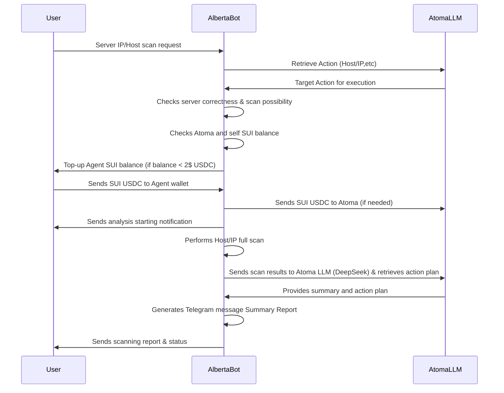
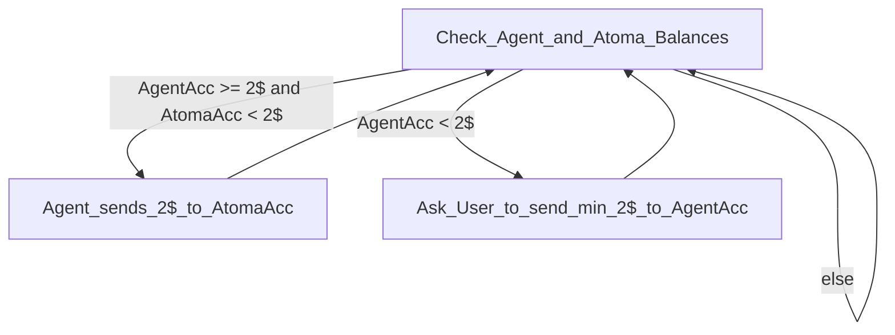

# [```Alberta```] Cybersecurity AI Assistant (Sui Agent Typhoon Hackathon)

 


```🚺 Alberta: I am ready to check your servers... Go ON! ```   
```👪 You: Tell me about my server vulnerabilities. IP XXX.XXX.XXX.XXX or DOMAIN NAME```   

> Bot link: https://t.me/AlbertaAssistantBot

Alberta AI Assistant 🤖 is an innovative Telegram bot designed to enhance the cybersecurity of server nodes through AI-driven analysis and secure server management. By scanning ports, detecting vulnerabilities, and offering actionable solutions, the bot aims to provide seamless protection for IT infrastructure.

This project leverages the ```SUI blockchain``` and integrates with the ```Atoma LLM models``` to create a robust solution that generates vulnerability reports directly within Telegram. Additionally, it uses the ElizaOS framework to configure an agent with Atoma keys within the SUI plugin.

The project takes on a significant challenge—securing server nodes in real time through AI—and aims to offer a comprehensive, automated solution for vulnerability scanning, with real-time recommendations.

## 🚀 Features

1. **Host/DomainName availability**: Runs network avalaibility checks
1. **Port Scanning**: Scans server nodes for open ports
1. **Vulnerability Detection**: Detects known vulnerabilities on servers and provides recommendations.
1. **Telegram Integration**: Summarizes vulnerabilities and solutions in easy-to-read summaries via Telegram.
1. **SUI Wallet**: Integration with SUI wallet for secure interactions and transactions.
1. **USDC Transactions**: Facilitates USDC transfers to pay for ATOMA service.
1. **Scanning Tools Used**:

- **Nmap**: A powerful tool for network discovery and vulnerability scanning, used to check open ports and identify services running on a server.
- **network-diagnostics** a library for diagnosing network problems

## 💡 Process Flow
  


## 💡 Accounts check flow




## 🛠️ Tools & Technologies

The bot currently handles scanning and vulnerability detection. Integration with ```SUI wallets``` and transaction handling (such as sending USDC).

The bot is built using the ```ElizaOS``` framework, ensuring maintainability and scalability. The implementation follows best practices for blockchain integration and Telegram bot development.

The integration of ```Atoma LLM provider``` for generating vulnerability reports, is a unique and innovative application of AI for real-time security reporting. The use of SUI blockchain for secure wallet management and transactions adds another layer of sophistication.

Host scanner tool **Nmap** is a powerful tool for network discovery and vulnerability scanning, used to check open ports and identify services running on a server.

## 🌟 Agent setup

Node v23 is required to run the agent (```nvm install 23.3.0```).

1. Clone the Repository

```bash
git clone https://github.com/yourusername/alberta-ai-assistant.git
cd alberta
```

2. Install Dependencies

```bash
pnpm clean && pnpm install && pnpm build
```

3. Start agent

```bash
pnpm start
```

[DEV mode] Start agent in debug mode

```bash
DEFAULT_LOG_LEVEL=debug pnpm start --dev 
```

## Planned Features
1. **Expanded Vulnerability Database**: Continuous improvement of the AI’s vulnerability detection capabilities, expanding beyond open ports and networking.
1. **Token Usage and LLM Cost Calculation**: The bot will calculate the costs associated with using the Atoma LLM for generating reports and provide this information to users.
1. **User Feedback**: The bot will prompt users for feedback and ratings of the scan results.

---

## 🤝 Hackathon Tracks & Partner Tools

- **Track:** Atoma/ElizaOS
- **Tools:**  
  - [Eliza Framework](https://github.com/ai16z) - Implementation reference >>>  [index.ts](/alberta/src/index.ts#L7)
  - [Atoma ](https://cloud.atoma.network/)  - Implementation reference >>> [index.ts](/alberta/src/chat/index.ts#L1)
  - [Telegram Bot API](https://core.telegram.org/bots)

Based on [Sui Agent Typhoon Participant Handbook ](https://notion.sui.io/sui-agent-typhoon-handbook)


### Partially re-used/adjusted codebase:
- [Eliza plugin-sui](https://github.com/elizaOS/eliza/tree/v0.1.9/packages/plugin-sui)
- [eliza-starter](https://github.com/elizaOS/eliza-starter)

---

## 📬 Contact Us

Have questions or want to collaborate?

- **Team Name:** GanAIWeb3Club
- **Email:** <skrypnychenkoandrii808@gmail.com>,<Tiunow@gmail.com>, <cryptospecura@gmail.com>, <grossbel13@gmail.com>.

---
