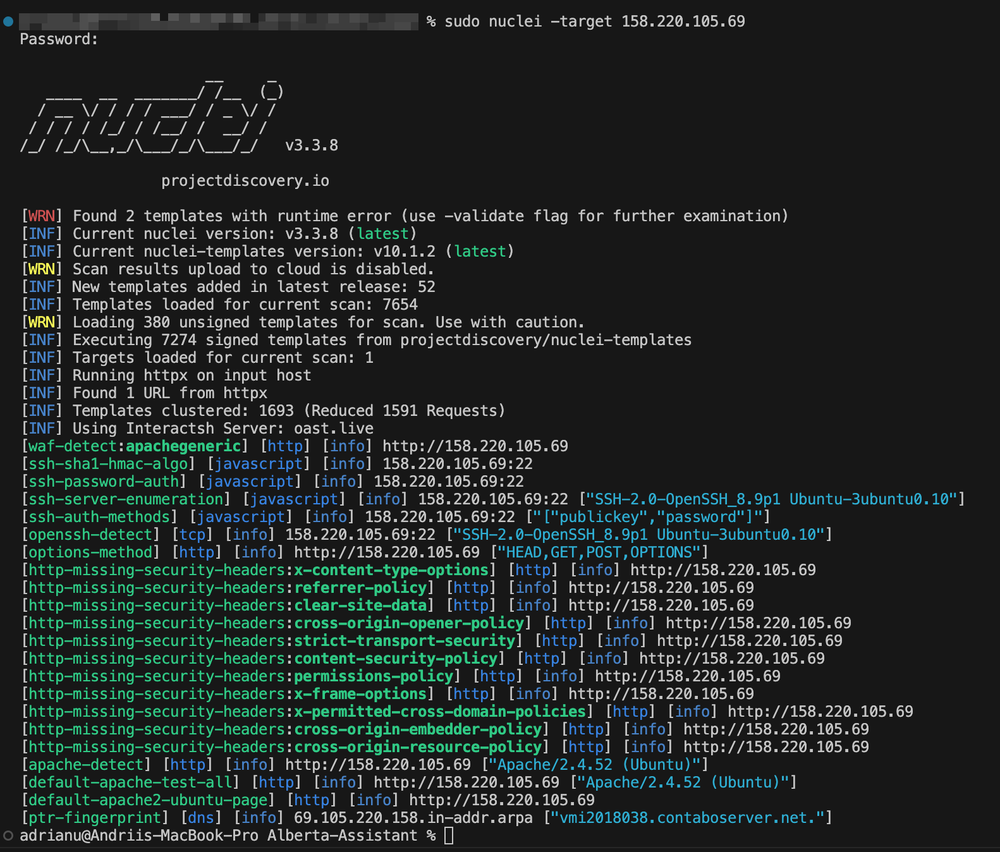
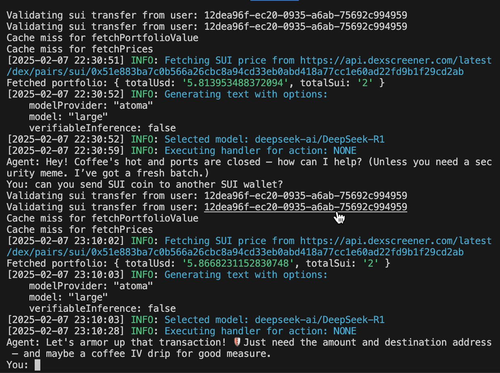

# Alberta-Assistant

AI assistant to keep nodes secured.
The goal of this project is to create an AI assistant that can scan ports, detect vulnerabilities, and provide solutions to secure the system.
Bot generates a summary report of the vulnerabilities in Telegram.

## Port scanning

The bot can scan ports of a given IP address and provide a list of open ports.
Ubuntu VPS scan example (server IP address is - 158.220.105.69 )

### Tools options

- Nmap
- nuclei: Nuclei is a fast tool for configurable targeted scanning based on templates offering massive extensibility and ease of use: <https://github.com/projectdiscovery/nuclei>

#### Nuclei installation

```bash
#MacOs  installation
brew install nuclei
nuclei -h
# Console output
sudo nuclei -target 158.220.105.69
# Streaming output in console and JSON
sudo nuclei -target 158.220.105.69 -stream -j -o ./scanner/nuclei_results/stream.json

# JSON output
sudo nuclei -target 158.220.105.69 -silent -j -o ./scanner/nuclei_results/test.json
# Fuzzing
sudo nuclei -target 158.220.105.69 -dast -j -o ./scanner/nuclei_results/dast.json 

```

Console output


#### Nuclei usage

```bash
sudo node scanner/nuclei.js
```

#### Nmap installation

```bash
# MacOS
brew update
brew install nmap

# Ubuntu
sudo apt update
sudo apt install nmap

npm init -y
npm install node-nmap
```

#### Nmap usage

```bash
sudo node scanner/nmap.js
```

Example output

```json
[
  {
    "hostname": "vmi1972177.contaboserver.net",
    "ip": "37.60.245.70",
    "mac": null,
    "openPorts": [
      {
        "port": 22,
        "protocol": "tcp",
        "service": "ssh",
        "method": "probed"
      },
      {
        "port": 80,
        "protocol": "tcp",
        "service": "http",
        "method": "probed"
      },
      {
        "port": 9000,
        "protocol": "tcp",
        "service": "http",
        "method": "probed"
      },
      {
        "port": 27017,
        "protocol": "tcp",
        "service": "mongodb",
        "method": "probed"
      },
      {
        "port": 31333,
        "protocol": "tcp",
        "service": "http",
        "method": "probed"
      }
    ],
    "osNmap": "Linux 5.0 - 5.14"
  }
]
```

## Atoma integration

### Installation

```bash

npm install dotenv
npm add https://github.com/atoma-network/atoma-sdk-typescript.git
```

### Run

```bash
node atoma_llm/atoma.js
```

### API reference

API docs: <https://docs.atoma.network/cloud-api-reference/chat/create-chat-completion>

## Agent setup

Node 23 is required to run the agent.

```bash
nvm install 23.3.0
npm install @elizaos/plugin-sui
pnpm clean && pnpm install && pnpm build
```
Start agent
```bash
pnpm start
```

### SUI blockchain integration

